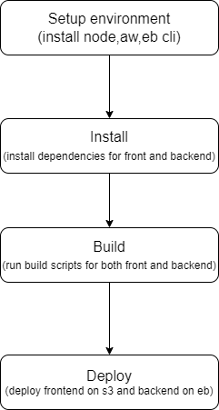

# Pipeline

## Process

1. Connect GitHub account to circle ci
2. install Node, the AWS cli and the EB cli using orbs
3. run FrontEnd and BackEnd install
4. run FrontEnd and BackEnd build
4. run FrontEnd and BackEnd deploy

#### Infrastructure

